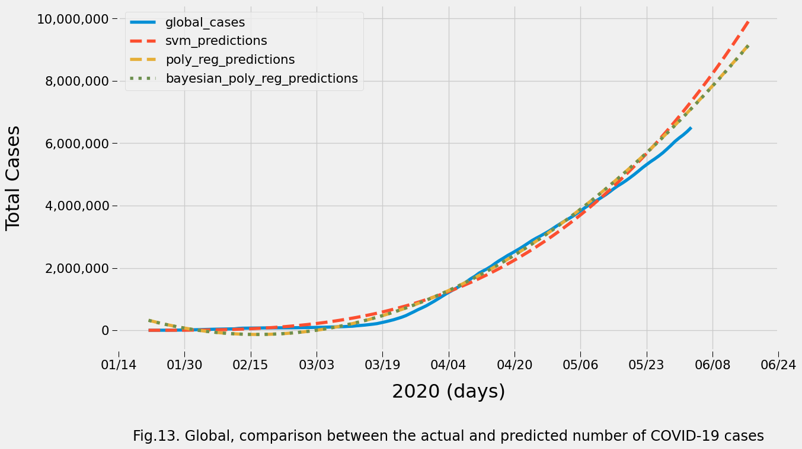

<br/><br/><br/><br/>

----------

# Social Distance: How to Pick a Fight with COVID-19 and Win

**Code Caviar Story**: https://www.bingyune.com/blog/social-distance-covid19    

## Project Overview

Coronavirus is a family of viruses that are named for the crown-like spikes on their surface. The novel coronavirus, also known as SARS-CoV-2, is a contagious respiratory virus that was first reported in Wuhan, China. On February 2, 2020, the World Health Organization designated the name COVID-19 for the disease caused by the novel coronavirus. In response to the ongoing public health emergency, infectious disease researchers from institutions around the globe have developed forecast models to predict the potential spread of COVID-19. Forecasts are useful because they help us understand the most likely outcomes as well as best- and worst-case possibilities — and they can help policymakers make decisions that can lead us closer to those best-case outcomes.

**The goal of this project is to create a model that can provide a 14-day forecast for the number of global COVID-19 cases.** The project makes use of the COVID-19 Data Repository by the Center for Systems Science and Engineering (CSSE) at [Johns Hopkins University](https://github.com/CSSEGISandData/COVID-19). All of the data, mapping, and analysis in the repository is provided for non-profit public health, educational, and academic purposes. The repository relies upon publicly available data from multiple sources such as the [World Heal Organization](https://www.who.int/), the [European Centre for Disease Prevention and Control](https://www.ecdc.europa.eu/en/geographical-distribution-2019-ncov-cases), and the [US Centers for Disease and Control Prevention](https://www.cdc.gov/coronavirus/2019-ncov/index.html).

## Summary of Results


The trajectory of the COVID-19 pandemic continues to vary widely from country to country. The number of new cases each day appears to be leveling off or falling in some countries such Italy and Germany - most likely because of the countries' strict lockdown efforts. China, where the pandemic began, appears to have drastically reduced both the number of new cases and new deaths. On the other hand, in the United States, the number of new confirmed cases is still multiplying rapidly, as some states continue to resist the [more stringent measures](https://time.com/5827156/squashing-squash-curve-coronavirus-covid19/).



The forecasts are not without limitations. Without a more robust, "bottom's up" model of disease dynamics, the projections from the statistical, curve-fitting models in this project are incomplete. The current models - all of which have relatively poor MAE and RMSE scores - only depend on the observed data pattern of confirmed cases and do not take into account the underlying epidemic dynamics that continue to drive the data. Thus, the project asserts that the use of curve-fitting models are best suited for the early phases of a new infection, where the individual parameters of a bottom's up model do not have to be known and complex historical infection and fatality rates can be inferred.

Nevertheless, at this time, maintaining at least 6-feet of social distancing is still critical to slowing the spread of the virus. Here are three additional ideas that, if combined, would help to make it safer and more sustainable to go about our lives, reduce hospital admissions to more manageable levels, and better support those suffering from economic hardships.

*Give everyone a mask.* Industries and governments must coordinate to boost supply, ease export restrictions, and put measures in place to stop speculation and hoarding of medical masks. For the broader population, the key fact is that while wearing a basic mask (or cloth face coverings) does little to protect the wearer from the risk of getting infected, it does a lot to prevent the risk that the wearer spreads the virus to other people.

*Increase and improve testing.* In terms of testing, the priority should be on ensuring the detection of cases among people who, if they are positive, are very likely to spread the infection to large numbers of other people. Scaling up surveillance testing will get us the most value per test to reduce infections. Then, as test capacity grows, more people can be tested.

*Let people go outside.* People should be able to safely go to any outdoor space with ample room for social distancing, such as beaches, parks and trails. People should also limit how much time they spend in any indoor spaces with poor air exchange, lots of people, and no effective ability to social distance.

## Getting Started

Cloning the git repository and installing the provided packages will help you get a copy of the project up and running on your local machine. The analysis for this project was performed using Jupyter Notebook (.ipynb) and the packages were managed using the Anaconda platform.

```
git clone https://github.com/codecaviar/social_distance_covid19.git
conda env create -f environment.yml
```

File Description:
* environment.yml - packages used to perform this analysis
* notebook_social_distance_covid19.ipynb - Jupyter Notebook for this project including data exploration, feature engineering, and prediction modeling    

**NOTE:** The COVID-19 Data Repository by the Center for Systems Science and Engineering (CSSE) at Johns Hopkins University prohibits redistribution of the aggregated data set, so this repository only provides the filenames used in this project at the time of print:
* 06-03-2020.csv - daily case reports, including confirmed cases, death totals, recovered cases, and active cases
* time_series_covid19_confirmed_global.csv  - time series tables for the global confirmed cases. Australia, Canada and China are reported at the province/state level. Dependencies of the Netherlands, the UK, France and Denmark are listed under the province/state level. The US and other countries are at the country level.
* time_series_covid19_deaths_global.csv - time series tables for the global deaths totals
* time_series_covid19_recovered_global.csv - time series table for the global recovered cases

## Authors

- **BingYune Chen** - [LinkedIn](https://www.linkedin.com/in/bingyune-chen/)
- **BingYune & Co** - [GitHub](https://github.com/codecaviar)

## License

The project is licensed under the MIT License - see the [LICENSE](LICENSE) file for details.

## Acknowledgments

The Center for Systems Science and Engineering at Johns Hopkins University developed an interactive web-based dashboard to visualize and track reported cases in real-time: "The dashboard, first shared publicly on January 22, illustrates the location and number of confirmed COVID-19 cases, deaths and recoveries for all affected countries. It was developed to provide researchers, public health authorities and the general public with a user-friendly tool to track the outbreak as it unfolds."

The project referenced the following:
* https://systems.jhu.edu/research/public-health/ncov/
* https://github.com/reichlab/covid19-forecast-hub
* https://www.sciencedirect.com/science/article/pii/S0960077920302538
* https://www.vox.com/2020/5/13/21248157/testing-quarantine-masks-stimulus
* https://fivethirtyeight.com/features/why-its-so-freaking-hard-to-make-a-good-covid-19-model/
* https://projects.fivethirtyeight.com/covid-forecasts/

----------
The Code Caviar is a digital magazine about data science and analytics that dives deep into key topics, so you can experience the thrill of solving at scale.
